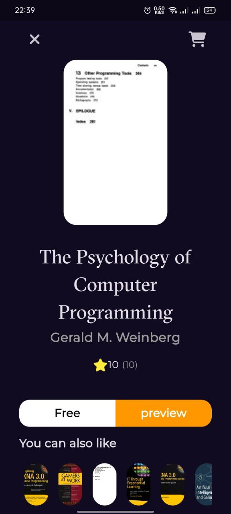

# Bookly App 📚

A sleek mobile application to explore books using the Google Books API. Built with Flutter, leveraging the **BLoC** state management pattern and the `dio` package for handling API requests.

## Features
- **Splash**: Welcomes users upon app launch.
- **Home**: Displays popular and featured books.
- **Search Functionality**: Search for books by title, author, or keywords.
- **Responsive UI**: Adaptive design for seamless user experience on various devices.

## Tech Stack
- **State Management**: BLoC (Business Logic Component).
- **Networking**: `dio` package.
- **API Integration**: Google Books API.
- **Language**: Dart (Flutter framework).
## Screenshots

<p align="center">
  
  
  
  
</p>

## Getting Started
### Prerequisites
- Flutter SDK installed (version X.Y.Z or later).
- An API key for Google Books API.

### Installation
1. Clone the repository:
   ```bash
   git clone https://github.com/AbderraoufBelaiouar/booklyapp.git
2. run the project
   ```bash
   flutter pub get
   flutter run

